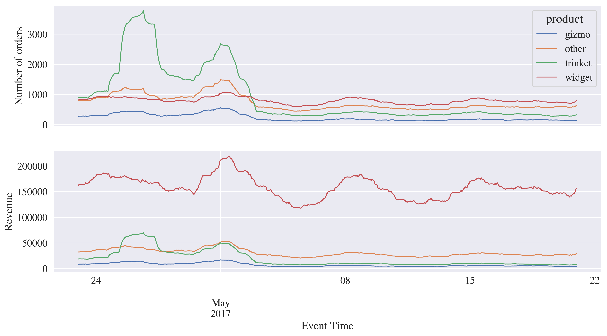
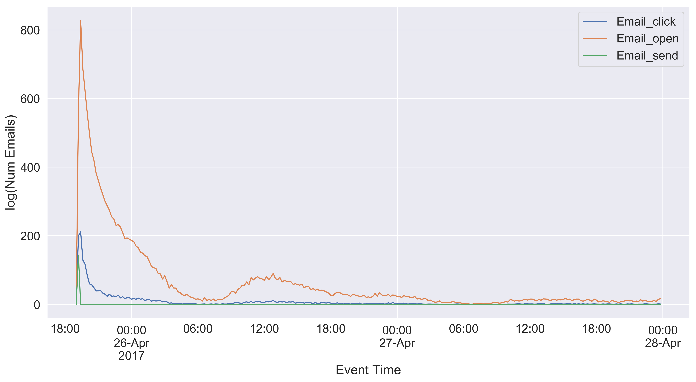
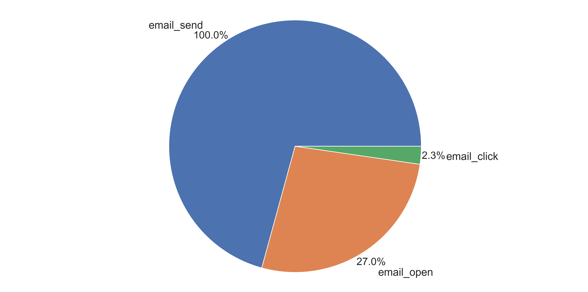
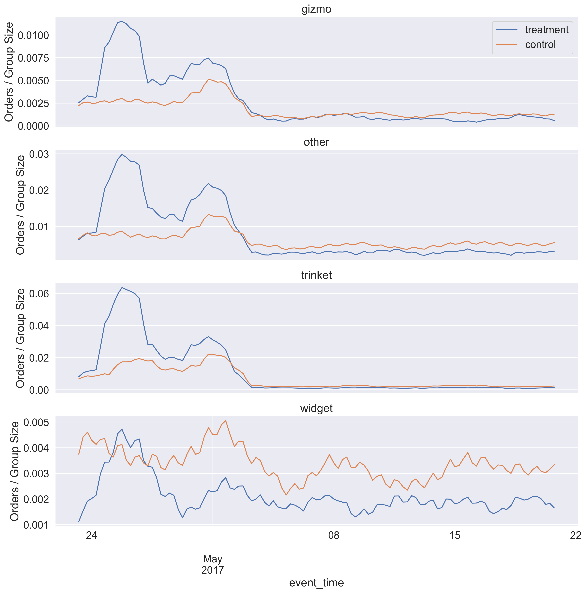
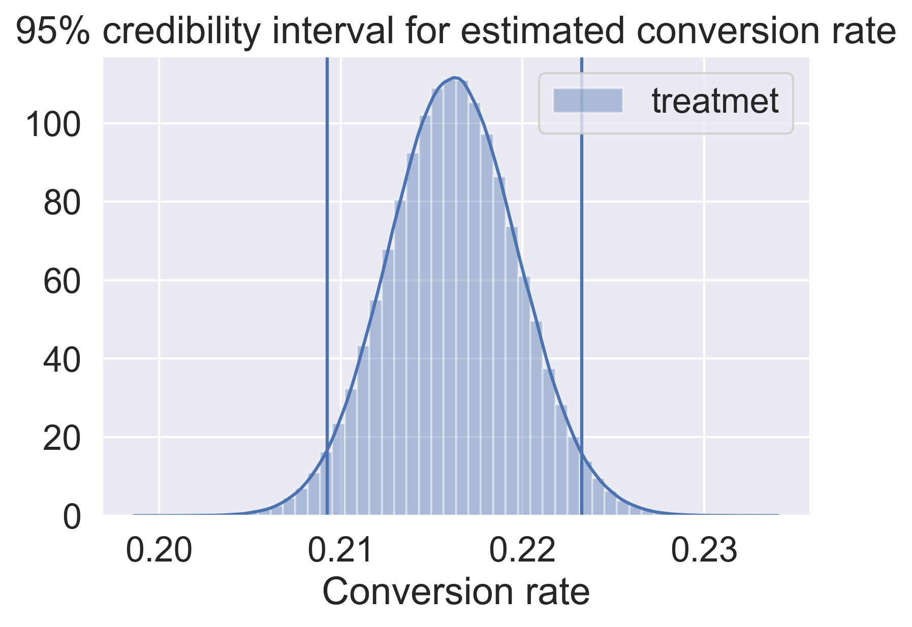
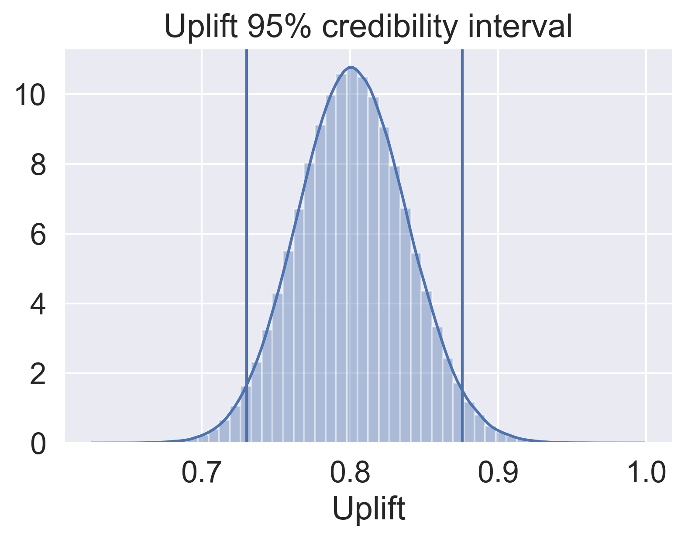
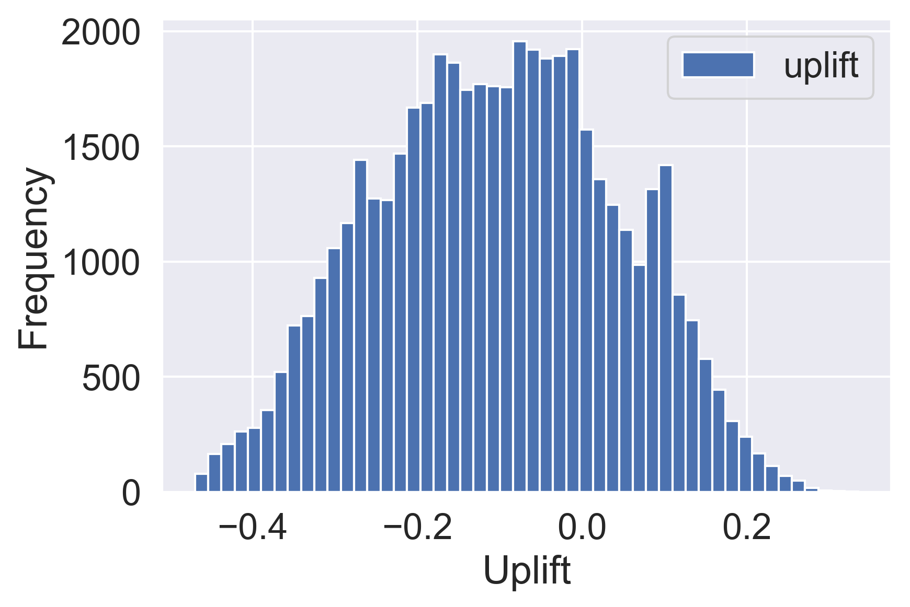

# WidgetCo Marketing Campaign

### Sam Mottahedi

# Introduction

The objective of this study is the analyze WidgetCo marketing campaign to re-engage customers who bought a widget the previous year. First, the effectiveness of the marketing campaign is determined by comparing few metrics such as conversion rate and generated revenue between customers who received marketing email (Treatment group) and those who didn't (Control group). Next, the subset of customers who should receive follow-up campaign and the content of the campaign are identified Uplift Modeling.

# Data

The datasets are as follows:

#### Table 1: Orders - a file containing events for purchases of WidgetCo's products.

<table border="1" class="dataframe">   <thead>     <tr style="text-align: right;">       <th></th>       <th>count</th>       <th>unique</th>       <th>top</th>       <th>freq</th>       <th>first</th>       <th>last</th>       <th>mean</th>       <th>std</th>       <th>min</th>       <th>25%</th>       <th>50%</th>       <th>75%</th>       <th>max</th>     </tr>   </thead>   <tbody>     <tr>       <th>product</th>       <td>44046</td>       <td>4</td>       <td>other</td>       <td>14328</td>       <td>NaN</td>       <td>NaN</td>       <td>NaN</td>       <td>NaN</td>       <td>NaN</td>       <td>NaN</td>       <td>NaN</td>       <td>NaN</td>       <td>NaN</td>     </tr>     <tr>       <th>event_type</th>       <td>44046</td>       <td>1</td>       <td>promo_order</td>       <td>44046</td>       <td>NaN</td>       <td>NaN</td>       <td>NaN</td>       <td>NaN</td>       <td>NaN</td>       <td>NaN</td>       <td>NaN</td>       <td>NaN</td>       <td>NaN</td>     </tr>     <tr>       <th>event_time</th>       <td>44046</td>       <td>29886</td>       <td>2017-05-01 16:12:14</td>       <td>12</td>       <td>2017-04-22 00:00:27</td>       <td>2017-05-21 23:58:50</td>       <td>NaN</td>       <td>NaN</td>       <td>NaN</td>       <td>NaN</td>       <td>NaN</td>       <td>NaN</td>       <td>NaN</td>     </tr>     <tr>       <th>id</th>       <td>44046</td>       <td>27149</td>       <td>8e8b9563-9f54-434f-b329-aab787f9b44f</td>       <td>46</td>       <td>NaN</td>       <td>NaN</td>       <td>NaN</td>       <td>NaN</td>       <td>NaN</td>       <td>NaN</td>       <td>NaN</td>       <td>NaN</td>       <td>NaN</td>     </tr>     <tr>       <th>revenue</th>       <td>44046</td>       <td>NaN</td>       <td>NaN</td>       <td>NaN</td>       <td>NaN</td>       <td>NaN</td>       <td>73.452</td>       <td>80.5918</td>       <td>0</td>       <td>17</td>       <td>30</td>       <td>160</td>       <td>1140</td>     </tr>   </tbody> </table>

### Table 2: Params - a file containing parameters describing WidgetCo's customers.

<table border="1" class="dataframe">   <thead>     <tr style="text-align: right;">       <th></th>       <th>count</th>       <th>unique</th>       <th>top</th>       <th>freq</th>       <th>first</th>       <th>last</th>       <th>mean</th>       <th>std</th>       <th>min</th>       <th>25%</th>       <th>50%</th>       <th>75%</th>       <th>max</th>     </tr>   </thead>   <tbody>     <tr>       <th>id</th>       <td>1307992</td>       <td>1307992</td>       <td>b755926d-3ed5-4fcb-9514-c46ee3e705d5</td>       <td>1</td>       <td>NaN</td>       <td>NaN</td>       <td>NaN</td>       <td>NaN</td>       <td>NaN</td>       <td>NaN</td>       <td>NaN</td>       <td>NaN</td>       <td>NaN</td>     </tr>     <tr>       <th>has_purchased_widget</th>       <td>512207</td>       <td>2</td>       <td>t</td>       <td>405617</td>       <td>NaN</td>       <td>NaN</td>       <td>NaN</td>       <td>NaN</td>       <td>NaN</td>       <td>NaN</td>       <td>NaN</td>       <td>NaN</td>       <td>NaN</td>     </tr>     <tr>       <th>has_purchased_trinket</th>       <td>512207</td>       <td>2</td>       <td>f</td>       <td>359310</td>       <td>NaN</td>       <td>NaN</td>       <td>NaN</td>       <td>NaN</td>       <td>NaN</td>       <td>NaN</td>       <td>NaN</td>       <td>NaN</td>       <td>NaN</td>     </tr>     <tr>       <th>has_purchased_gizmo</th>       <td>512207</td>       <td>2</td>       <td>f</td>       <td>461688</td>       <td>NaN</td>       <td>NaN</td>       <td>NaN</td>       <td>NaN</td>       <td>NaN</td>       <td>NaN</td>       <td>NaN</td>       <td>NaN</td>       <td>NaN</td>     </tr>     <tr>       <th>order_count</th>       <td>512207</td>       <td>NaN</td>       <td>NaN</td>       <td>NaN</td>       <td>NaN</td>       <td>NaN</td>       <td>1.19334</td>       <td>1.93217</td>       <td>1</td>       <td>1</td>       <td>1</td>       <td>1</td>       <td>799</td>     </tr>     <tr>       <th>first_order_date</th>       <td>512207</td>       <td>1200</td>       <td>2017-04-26 00:00:00</td>       <td>2518</td>       <td>2014-04-22 00:00:00</td>       <td>2017-08-03 00:00:00</td>       <td>NaN</td>       <td>NaN</td>       <td>NaN</td>       <td>NaN</td>       <td>NaN</td>       <td>NaN</td>       <td>NaN</td>     </tr>     <tr>       <th>last_order_date</th>       <td>512207</td>       <td>1200</td>       <td>2017-04-26 00:00:00</td>       <td>2932</td>       <td>2014-04-22 00:00:00</td>       <td>2017-08-03 00:00:00</td>       <td>NaN</td>       <td>NaN</td>       <td>NaN</td>       <td>NaN</td>       <td>NaN</td>       <td>NaN</td>       <td>NaN</td>     </tr>     <tr>       <th>lifetime_revenue</th>       <td>512116</td>       <td>NaN</td>       <td>NaN</td>       <td>NaN</td>       <td>NaN</td>       <td>NaN</td>       <td>17081.3</td>       <td>12932.6</td>       <td>400</td>       <td>12400</td>       <td>17000</td>       <td>20000</td>       <td>3.55237e+06</td>     </tr>   </tbody> </table>

#### Table 3: Email - A file containing email send, open, and click events for this campaign over one month

<table border="1" class="dataframe">   <thead>     <tr style="text-align: right;">       <th></th>       <th>count</th>       <th>unique</th>       <th>top</th>       <th>freq</th>       <th>first</th>       <th>last</th>     </tr>   </thead>   <tbody>     <tr>       <th>id</th>       <td>375626</td>       <td>265736</td>       <td>b4fe117c-c124-4445-a847-0fca26398002</td>       <td>921</td>       <td>NaN</td>       <td>NaN</td>     </tr>     <tr>       <th>event_time</th>       <td>375626</td>       <td>48534</td>       <td>2017-04-25 19:17:39</td>       <td>12002</td>       <td>2017-04-25 19:00:51</td>       <td>2017-05-21 23:56:04</td>     </tr>     <tr>       <th>event_type</th>       <td>375626</td>       <td>3</td>       <td>email_send</td>       <td>265737</td>       <td>NaN</td>       <td>NaN</td>     </tr>   </tbody> </table>

## Exploratory Data Analysis

### Change in orders during campaign period

The first email in the marketing campaign is sent on 04/25/2017 and there is an increase in the number of order specially trinket orders. There is a second pick in both revenue and number of orders on the May 1st. The sudden rise in the number of orders and revenue is positive but it is not possible to say that the change is due to the email campaign.

### Email delivery

All emails were sent around 19:00 04/25/2017. Customers that opened the emails did so immediately and the portion of these customers also clicked on the links. Another subset of customers opened the mails the next day around 12 PM but not many of the clicked on the link.

## Control and Treatment Group

In order to measure performance of the campaign we need to determine the customers in control and treatment group. We are only intrested in customers who have bought a product in the last 12 months. The treatment group are customers who recived and opened the email and the control group are subset of customers who didn't get email.

Figure 4 shows the number of order divided by number of each customer in control and treatment group for the 4 product type after email campaign. It can be seen that the treatment group has higher number orders in all 4 categories imideatly after the emails were sent.

More detailed exploratory analysis of the the three datasets can be found in a separate Jupyter Noteook.

# Methods

## Campaign Effectiveness

### Conversion Rate

We can estimate conversion rate as:

\begin{equation}
R = \frac{k}{n}
\end{equation}

where $n$ is the number of individuals who received the treatment and $k$ is the number of customers who converted and bought a product after receiving the marketing email. Since the obtained estimate is not statistically reliable, we need to estimate the confidence interval and have some sense of variance in the estimate if the similar campaign was repeated:

To find the distribution of the conversion rate given the observed number of conversion in the data $p(R|k)$ we can use Bayesian approach and Monte Carlo simulation:

\begin{equation}
P(R|k) = \frac{p(k|R) p(R)}{p(k)}
\end{equaiton}

Using a binomial distribution for the likelihood function and a conjugate prior (beta distribution), we get a beta distribution for our posterior distribution ($P(R|k)$).

\begin{equation}
p(R|k) \propto beta(k+x n-k + y)
\end{equation}

The probability that conversion rate ($R$) lies within a credible interval [a, b] can be calculated as:

\begin{equation}
Pr(a < R < b) = \int_a^b beta(k +1, n-k+1) dr
\end{equation}

### Conversion Rate Uplift

Another metric we can use is the uplift which is the difference between conversion rates in the treatment and control group.

\begin{equation}
L = \frac{R}{R_0}  -1
\end{equation}

The credible interval ofr uplift $L$ is:

\begin{equation}
P(a < L < b) = \int \int L(R_T, R_C) \dot Pr(R_T, R_C) dR_T dR_C
\end{equation}

where $R_T$ a $R_C$ are the conversion rate for treatment and control group respectively.

assuming the independence between test and control groups the joint probability is $P(R_T, R_C) = P(R_C | K_C, n_C)   P(R_T | K_T, n_T)$.

## Uplift Modeling

The idea is to send an additional email to subset of customers and trying to maximize the uplift between treatment and control group.

\begin{equation}
uplift(x) = P(R|T, x) - P(R| C,x)
\end{equation}

In this study, the class variable modification approach was used (Jakowski, Jaroszewcz 2012). The new response variable for classification is defined as follow:

\begin{equation}
Z = \{
       \begin{tabular}{c}
       1 if Treatment and converted \\
       1 if Control and not converted \\
       0 otherwise
       \end{tabular}
\end{equation}

The variable modification enables us to calculate the uplift using single classification model.

\begin{equation}
uplift(x) = 2 P(Z = 1| x) -1
\end{equation}

The $x$ in the uplift model is the covariates describing the customer. Using a logistic regression for uplift model and using the calculated logistic regression coeficients we can find out which features increased the probability of conversion and design the future campaign content accordingly.

# Results

### Conversion Rate

The conversion in the two group

| Group  | N |  K | Conversion Rate | 95% Credible interval|
|:---:|:---:|:---:|:---:|:---:|
| Control  | 48534  |  5823 |  21.6% | (0.209, 0.223)|
| Treatment  | 13291  |  2873 | 12.0%  | (0.117, 0.123)|

Figure 5 shows the $95\%$ credibility interval for the conversion rate.

### Uplift

The estimated uplift is $0.81$. Figure 6 shows the credibility interval for the uplift estimate.

### Uplift Modeling

A logistic regression model was used as described in the method section. SMOTE (Synthetic Minority Over-sampling) was to generate a balanced dataset for training. The model is regularized using $l2$ norm. Subtracting the conversion probability when treatment is applied from control group we can find the uplift metric for customers and send future campaign only to those with the highest uplift. Figure 7 shows the distribution of estimated uplift.

The result of logistic regression can be used to determine the appropriate content of future campaigns. Table 1 shows the result of the logistic regression analysis:

<table class="simpletable"><tr>        <td>Model:</td>              <td>Logit</td>      <td>Pseudo R-squared:</td>    <td>0.030</td>   </tr><tr>  <td>Dependent Variable:</td>         <td>y</td>              <td>AIC:</td>        <td>41350.8196</td> </tr><tr>         <td>Date:</td>        <td>2018-10-24 12:29</td>       <td>BIC:</td>        <td>41409.2003</td> </tr><tr>   <td>No. Observations:</td>        <td>30949</td>       <td>Log-Likelihood:</td>    <td>-20668.</td>  </tr><tr>       <td>Df Model:</td>              <td>6</td>            <td>LL-Null:</td>        <td>-21317.</td>  </tr><tr>     <td>Df Residuals:</td>          <td>30942</td>        <td>LLR p-value:</td>    <td>6.4940e-277</td></tr><tr>      <td>Converged:</td>           <td>1.0000</td>           <td>Scale:</td>         <td>1.0000</td>   </tr><tr>    <td>No. Iterations:</td>        <td>6.0000</td>              <td></td>               <td></td>      </tr></table><table class="simpletable"><tr>             <td></td>              <th>Coef.</th>  <th>Std.Err.</th>     <th>z</th>     <th>P>|z|</th>  <th>[0.025</th>  <th>0.975]</th> </tr><tr>  <th>has_purchased_widget</th>    <td>-0.2656</td>  <td>0.0299</td>   <td>-8.8757</td> <td>0.0000</td>  <td>-0.3242</td> <td>-0.2069</td></tr><tr>  <th>has_purchased_trinket</th>   <td>0.0442</td>   <td>0.0214</td>   <td>2.0665</td>  <td>0.0388</td>  <td>0.0023</td>  <td>0.0861</td> </tr><tr>  <th>has_purchased_gizmo</th>     <td>-0.1784</td>  <td>0.0267</td>   <td>-6.6804</td> <td>0.0000</td>  <td>-0.2308</td> <td>-0.1261</td></tr><tr>  <th>order_count</th>            <td>-24.4213</td>  <td>7.6247</td>   <td>-3.2029</td> <td>0.0014</td> <td>-39.3655</td> <td>-9.4771</td></tr><tr>  <th>lifetime_revenue</th>        <td>4.6212</td>   <td>2.4326</td>   <td>1.8997</td>  <td>0.0575</td>  <td>-0.1467</td> <td>9.3891</td> </tr><tr>  <th>days_since_last_order</th>   <td>-1.3905</td>  <td>0.0461</td>  <td>-30.1327</td> <td>0.0000</td>  <td>-1.4810</td> <td>-1.3001</td></tr><tr>  <th>days_since_first_order</th>  <td>1.5593</td>   <td>0.0632</td>   <td>24.6901</td> <td>0.0000</td>  <td>1.4355</td>  <td>1.6831</td> </tr></table>

We can see that we should address the customers who didn't order very significant time has passed since their first order. Also targeting costumers with high lifetime revenue is better. In addition, sending marketing campaign to customers that previously ordered trinket with advertising related to trinkets is more effective.

# Conclusion

The performance of the marketing campaign was measured by calculating the conversion rate and uplift metrics. The conversion rate of customer who received the marketing email was $9.6\%$ higher compared to the customer who didn't. The uplift which is a measure of the incremental increase in conversion rate when customers exposed to marketing campaign emails is $0.81$. Both metrics show that the marketing campaign was effective. Uplift modeling resulted in the identification of $25\%$ of customers where future marketing campaign will increase the conversion rate. The logistic regression used in uplift modeling showed that targeting customers with high lifetime revenue and content related to trinket product will increase the probability of conversion.
